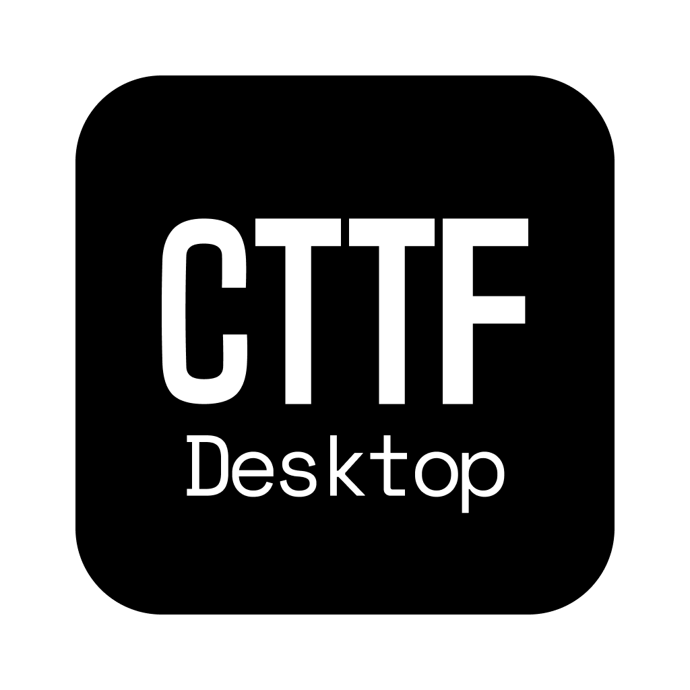
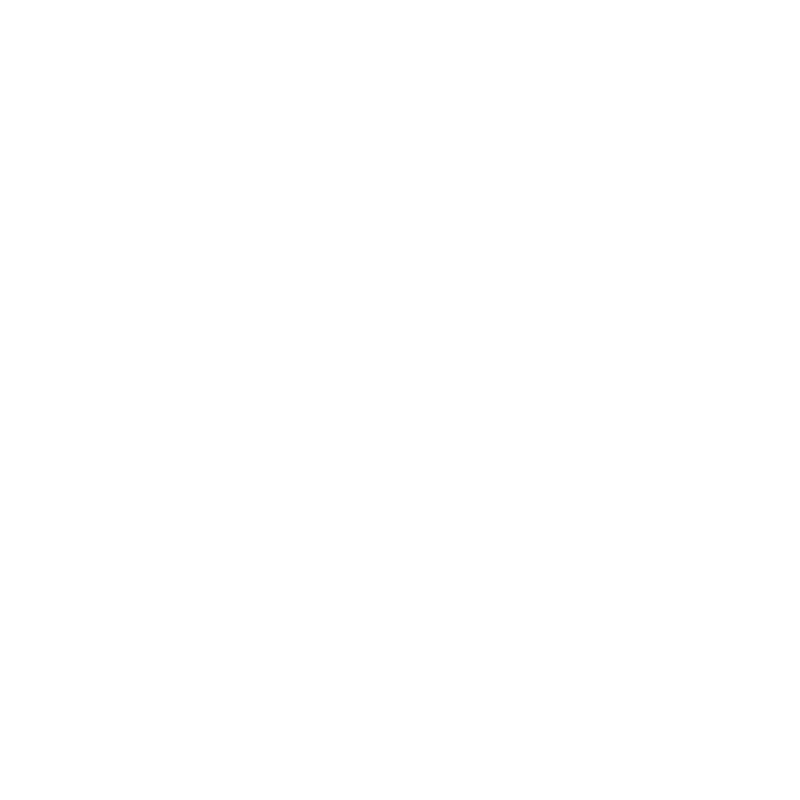
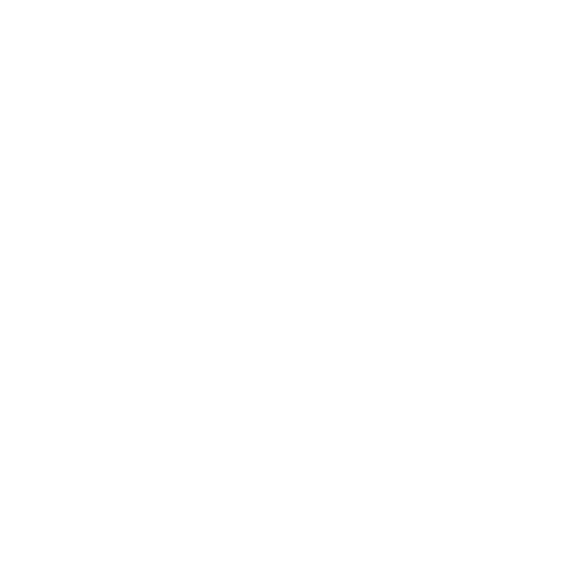

<p align="center">
  
</p>

<h1 align="center">Cursor Talk to Figma desktop</h1>

<p align="center">
  <b>A Kotlin-based desktop companion for seamless Figma-to-MCP integration</b>
  <br>
  <i>Ported from the original TypeScript project with enhanced desktop capabilities</i>
</p>

<p align="center">
  <a href="https://github.com/FigmaAI/TalkToFigmaDesktop/releases">
    
  </a>
  <a href="https://github.com/FigmaAI/TalkToFigmaDesktop/blob/main/LICENSE">
    
  </a>
  <a href="https://kotlinlang.org/">
    
  </a>

</p>

<p align="center">
  <a href="#installation">Installation</a> •
  <a href="#getting-started">Getting Started</a> •
  <a href="#features">Features</a> •
  <a href="#original-project">Original Project</a> •
  <a href="#troubleshooting">Troubleshooting</a>
</p>

---

## 🙏 Acknowledgments to Original Project

> [!TIP]
> This project is a Kotlin Compose Desktop application ported from [@sonnylazuardi](https://github.com/sonnylazuardi)'s [**cursor-talk-to-figma-mcp**](https://github.com/sonnylazuardi/cursor-talk-to-figma-mcp) project, enabling direct WebSocket and MCP server capabilities. We deeply appreciate the innovative ideas and implementation of the original project.

## Features

- 🚀 **Start/Stop Servers**: Control WebSocket and MCP servers from tray menu
- 📊 **View Logs**: Built-in log viewer with clear and copy functions
- ⚙️ **MCP Configuration**: Easy copy-paste configuration for Cursor or whatever
- 🔄 **Auto Port Management**: Automatic port conflict resolution
- 🖥️ **System Tray**: Clean interface with status indicators
- 📈 **Analytics & Crash Reporting**: Google Analytics integration for monitoring app usage and crashes

## Installation

### Download Pre-built Releases

1. Go to [Releases](https://github.com/FigmaAI/TalkToFigmaDesktop/releases)
2. Download the appropriate version for your platform:
   - **macOS**: `Cursor Talk to Figma desktop-macOS.dmg`
   - **Windows**: `Cursor Talk to Figma desktop-Windows.msi`

### macOS Installation

1. **Download and Install**
   - Open the downloaded DMG file
   - Drag "Cursor Talk to Figma desktop" to your Applications folder
   - Launch the application - it will start immediately without security warnings

> [!NOTE]
> **Enhanced Security**: This application is now code-signed and notarized by Apple, ensuring secure installation and execution without security warnings on macOS.

### Windows Installation

1. **Download and Install**
   - Run the downloaded MSI installer
   - Follow the installation wizard
   - Launch from Start menu or desktop shortcut

> [!TIP]
> **Windows SmartScreen**: If Windows Defender shows a SmartScreen warning, click "More info" → "Run anyway" to proceed. This is normal for new applications not yet widely recognized by Microsoft's reputation system.

## Getting Started

### 1. Launch Cursor Talk to Figma desktop

- **macOS**: Find in Applications folder or Launchpad
- **Windows**: Start menu → Cursor Talk to Figma desktop

The application will appear in your system tray with a server icon.

### 2. Start the Servers

Right-click the system tray icon and select:
- **"Start All Services"** - Starts both WebSocket (port 3055) and MCP (port 3056) servers
- Or start them individually if needed

> [!WARNING]
> **Port Requirements**: Cursor Talk to Figma desktop requires ports **3055** (WebSocket) and **3056** (MCP) to be available. If you have other applications using these ports, you may need to stop them first or use "Kill All Servers" from the tray menu.

You'll see status indicators:
- : Servers running
- : Servers stopped

### 3. Configure MCP in Cursor

1. Click the tray icon → **"MCP Configuration"**
2. Copy the displayed configuration
3. Paste into your Cursor settings under MCP servers:

> [!NOTE]
> The config contains both Cursor Talk to Figma desktop and the official Figma DevMode MCP server URL.

```json
{
  "mcpServers": {
    "Figma": {
      "url": "http://127.0.0.1:3845/mcp"
    },
    "TalkToFigmaDesktop": {
      "url": "http://127.0.0.1:3056/sse"
    }
  }
}
```

### 4. Install Figma Plugin

Install the official plugin: [**Cursor Talk to Figma MCP Plugin**](https://www.figma.com/community/plugin/1485687494525374295/cursor-talk-to-figma-mcp-plugin)

> [!IMPORTANT]
> **Important Note About Prerequisites**: The plugin page may mention installing bun.sh and other prerequisites. **These are NOT required when using Cursor Talk to Figma desktop**, as this application already includes all necessary server components. You can safely ignore those instructions and simply install the plugin directly.

> [!TIP]
> **Plugin Connection**: The Figma plugin will automatically attempt to connect to your desktop app on port 3055. Make sure Cursor Talk to Figma desktop is running with servers started before launching the plugin.

### 5. Connect and Use

1. **In Figma**: Run the plugin and ensure it connects to the desktop app
2. **In Cursor**: The MCP server will now be available for AI interactions
3. **Start Creating**: Use Cursor AI with seamless Figma integration!


## Troubleshooting

> [!NOTE]
> **Quick Diagnosis**: Most issues can be resolved by checking the application logs. Right-click the tray icon → "View Logs" to see detailed error information.

### Common Issues

**🔌 Connection Problems**
- Ensure both servers are running 
- Check that ports 3055 and 3056 are not blocked by firewall
- Try "Kill All Servers" from tray menu and restart

> [!TIP]
> **Firewall Issues**: If your firewall is blocking connections, add exceptions for ports 3055 and 3056, or temporarily disable the firewall to test connectivity.

**🛡️ Installation Issues** 
- macOS: Application is code-signed and notarized - no security warnings expected
- Windows: If Windows Defender shows a SmartScreen warning, click "More info" → "Run anyway"

**🔧 Port Conflicts**
- The app automatically handles port conflicts with enhanced retry logic
- If issues persist, manually kill processes using ports 3055/3056
- Check logs via "View Logs" in the tray menu

> [!WARNING]
> **Force Kill Ports**: If automatic port management fails, you can manually kill processes using these commands:
> - **macOS/Linux**: `lsof -ti:3055 | xargs kill -9` and `lsof -ti:3056 | xargs kill -9`
> - **Windows**: `netstat -ano | findstr :3055` then `taskkill /PID <PID> /F`

### Logs and Debugging

Access detailed logs via:
1. Right-click tray icon → **"View Logs"**
2. Use **Clear** to reset log view to current session
3. Use **Copy** to share logs for troubleshooting

## Google Analytics Setup

### Configuration

The app includes Google Analytics integration for crash reporting and usage analytics. To enable this feature:

1. **Create a Google Analytics 4 Property**
   - Go to [Google Analytics](https://analytics.google.com/)
   - Create a new GA4 property
   - Note your Measurement ID (format: `G-XXXXXXXXXX`)

2. **Configure Analytics**
   - Set environment variables in your `.envrc` file:
     ```bash
     export GOOGLE_ANALYTICS_ID="G-XXXXXXXXXX"
     export GOOGLE_ANALYTICS_API_SECRET="your_api_secret_here"
     ```
   - Or set them in your system environment
   - The app will automatically load these values from environment variables

3. **Enable Features**
   - Set `analytics.crash.reporting.enabled=true` for crash reporting
   - Set `analytics.user.tracking.enabled=true` for user action tracking
   - Set `analytics.debug.mode=false` for production

### Privacy

- Analytics data is sent to Google Analytics servers
- No personally identifiable information is collected by default
- Users can opt out by setting `analytics.user.id=` (empty)
- Crash reports include system information for debugging

### Data Collected

- App start/stop events
- Server start/stop events
- Crash reports with stack traces
- System information (OS, memory, etc.)
- User actions (optional)

## Building from Source

### Prerequisites

- JDK 21+
- Kotlin 2.0.0+
- Gradle 8.12+

> [!TIP]
> **Development Setup**: For the best development experience, use IntelliJ IDEA with the Kotlin plugin. The project is configured with Compose Desktop and includes hot-reload capabilities for UI development.

### Build Commands

```bash
# Clone the repository
git clone https://github.com/FigmaAI/TalkToFigmaDesktop.git
cd TalkToFigmaDesktop

# Build the application
./gradlew build

# Run during development
./gradlew :app:run

# Create platform distributables
./gradlew :app:packageDistributionForCurrentOS
```

> [!NOTE]
> **Release Builds**: Tagged releases (e.g., `v1.0.0`) trigger automatic builds via GitHub Actions, creating signed distributables for macOS and Windows. See `.github/workflows/build.yml` for details.


## Original Project

**[cursor-talk-to-figma-mcp](https://github.com/sonnylazuardi/cursor-talk-to-figma-mcp)** by [@sonnylazuardi](https://github.com/sonnylazuardi)

### Key Differences

| Original (TypeScript) | This Port (Kotlin) |
|----------------------|-------------------|
| Node.js server | JVM desktop application |
| Command-line interface | System tray GUI |
| Manual port management | Automatic port conflict resolution |
| Basic logging | Visual log viewer with filtering |
| Terminal-based config | GUI configuration dialogs |

Both implementations share the same core MCP protocol and Figma plugin compatibility.

## Contributing

We welcome contributions! Please see our [Contributing Guidelines](CONTRIBUTING.md) for details.

> [!TIP]
> **First Time Contributors**: Start by checking our [Issues](https://github.com/FigmaAI/TalkToFigmaDesktop/issues) page for beginner-friendly tasks labeled with `good first issue`. We also appreciate documentation improvements and bug reports!

1. Fork the repository
2. Create a feature branch (`git checkout -b feature/amazing-feature`)
3. Commit your changes (`git commit -m 'Add amazing feature'`)
4. Push to the branch (`git push origin feature/amazing-feature`)
5. Open a Pull Request

## License

This project is licensed under the MIT License - see the [LICENSE](LICENSE) file for details.

## Support

- 🐛 [Report Issues](https://github.com/FigmaAI/TalkToFigmaDesktop/issues)
- 💡 [Request Features](https://github.com/FigmaAI/TalkToFigmaDesktop/issues/new?template=feature_request.md)
- 💬 [Discussions](https://github.com/FigmaAI/TalkToFigmaDesktop/discussions)

---

<p align="center">
  <sub>Built with ❤️ using Kotlin and Compose for Desktop</sub>
</p>
